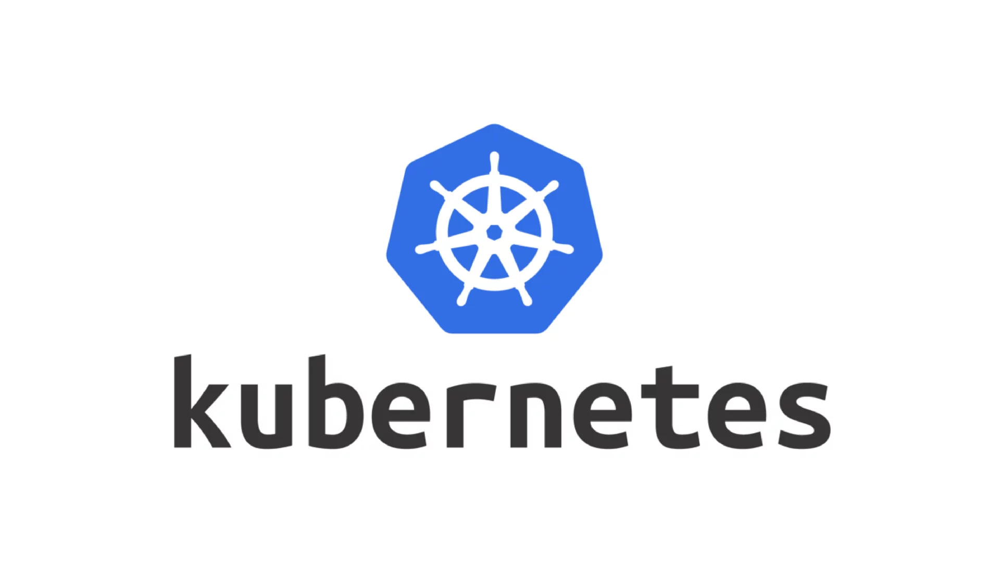

# My Kubernetes Homelab.

Currently, I'm focusing on learning Kubernetes. I first experimented with Docker on CentOS when I was using ClearOS. Since then, I’ve been fascinated by container technology.

For a while, I took a step back from homelabbing. That changed when I came across various DePin projects and realized I needed virtualization.

Before that, the ClearOS project came to a halt and development stopped, so I moved on and tried unRAID for a while. I also experimented with Synology, which was stable and user-friendly, but both platforms felt too constrained — I couldn’t really learn new things with them.

That’s when I decided it was time for virtualization with Proxmox, which opened the door to learning even more. Since Proxmox also supports LXC containers, containers came back into the picture as well.

During my internship, we discussed Kubernetes, which got me excited and motivated to dive deeper into it. I’m currently learning Kubernetes through the KodeKloud learning platform, which offers hands-on labs and real-world scenarios. I’m also active in Mischa's DevOps community, where I connect with like-minded people and continue learning through shared experience.

A homelab is a great place to build, break, and fix things and to keep learning.
 
 
[Install Kubernetes bare metal](install_kubernetes.md)

[Connect old k8s-worker to new control plane](tips_tricks.md)

[Cheat sheet](cheat_sheet.md)

[Tips & Tricks](tips_tricks.md)
